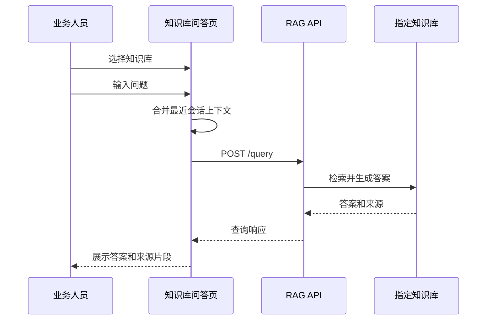

# 知识库问答页面设计

日期：2026-05-17  
状态：已确认方向，待实施计划  
范围：新增业务人员使用的知识库查询对话页面

## 背景

现有系统已经具备知识库创建、文件上传、导入进度、文档列表和 RAG 查询能力。当前入口更偏管理和系统能力验证，业务人员如果只想查询资料，需要理解知识库页面、接口或陪练流程，使用成本偏高。

本功能新增一个独立的“知识库问答”页面，让业务人员通过自然语言对话查询指定知识库中的资料。页面同时保留来源依据，帮助用户判断回答是否来自正确资料。

## 用户和目标

目标用户是业务人员，而不是系统管理员或开发人员。

核心目标：

- 用户可以先选择一个知识库，再围绕该知识库进行多轮资料问答。
- 系统默认返回 AI 整理后的自然语言答案，而不是只给原始检索结果。
- 每条回答展示来源文件名和相关片段，便于用户核对依据。
- 当知识库没有命中资料时，系统明确提示未找到相关内容，避免编造。
- 页面作为独立侧边栏入口，不与知识库管理页面混在一起。

## 非目标

第一版不实现以下能力：

- 查询历史持久化。
- 收藏、点赞、反馈闭环。
- 跨知识库自动匹配。
- 权限管理。
- 复杂技术调试面板，例如 embedding 分数、rerank 详情、底层查询模式全量展示。
- 上传验收专用诊断流程。

这些能力可以在业务查询体验稳定后作为后续版本规划。

## 入口和命名

侧边栏新增一个导航项：

- 名称：知识库问答
- 页面标识建议：`knowledge-chat`
- 图标建议：沿用轻量文本图标或后续统一替换为图标库

总览页可以后续增加快捷卡片，但第一版只要求侧边栏入口可达。

## 页面布局

页面采用左右两栏布局。

左侧为问答主区域：

- 顶部工具栏：知识库选择器、新会话按钮。
- 消息流：展示用户问题、系统回答、加载状态和空状态。
- 底部输入区：多行输入框、发送按钮。

右侧为来源依据区域：

- 默认展示当前最新回答的来源依据。
- 每条来源包含文件名和相关片段。
- 用户点击某条来源时，该来源高亮，便于核对。
- 没有来源时显示空状态，不展示技术错误细节。

移动端或窄屏下，来源依据区域可以折叠到回答消息下方，避免左右布局挤压输入区。

## 核心交互

1. 用户进入“知识库问答”页面。
2. 页面加载当前知识库列表。
3. 用户选择一个知识库。
4. 用户输入问题并发送。
5. 页面展示用户消息和“正在查询”状态。
6. 前端携带当前知识库、当前问题和必要的多轮上下文调用查询能力。
7. 系统返回 AI 整理后的答案。
8. 页面在回答下方或右侧显示来源文件名和相关片段。
9. 用户可以继续追问，系统参考当前会话上下文。
10. 用户点击“新会话”后清空消息和上下文，但保留当前知识库选择。

## 回答规则

回答应面向业务人员，优先清晰、简洁、可执行。

约束：

- 回答必须基于选定知识库的检索结果。
- 如果没有相关来源，回答应说明“当前知识库未找到相关资料”，不能补充未被资料支持的具体事实。
- 来源依据只展示业务可理解的信息：文件名和相关片段。
- 技术信息默认不展示，可以在浏览器控制台保留必要日志用于开发排查。

## 多轮上下文

第一版由前端维护当前页面会话上下文。

上下文策略：

- 保存本次页面会话内最近若干轮用户问题和系统回答。
- 发起下一轮查询时，将历史摘要或最近消息合并为查询上下文。
- 点击“新会话”清空上下文。
- 切换知识库时，提示或自动开启新会话，避免不同知识库的上下文混用。

实现时应限制上下文长度，避免请求过长和回答漂移。第一版可以保留最近 3 至 5 轮。

## 前端组件设计

建议新增前端模块：

- `ai-tutor-system/static/js/knowledge-chat.js`

主要职责：

- 加载和渲染知识库选项，复用现有 `knowledgeState.databases`。
- 管理问答页状态：当前知识库、消息列表、当前来源、加载状态、错误状态。
- 渲染消息流、输入框、来源依据面板。
- 调用 RAG 查询接口并转换响应为页面模型。
- 处理新会话、切换知识库、发送快捷键。

需要修改：

- `ai-tutor-system/static/index.html`：增加侧边栏入口、页面 section、脚本引用。
- `ai-tutor-system/static/js/navigation.js`：如现有通用导航不需改动，则只依赖 `data-nav`。
- `ai-tutor-system/static/css/style.css`：新增问答页布局和消息样式。

## 后端和接口

第一版优先复用现有 RAG 服务，不新增复杂后端会话存储。

候选接口：

- `POST /query`：适合返回答案，并可包含来源字段。
- `POST /search`：适合获取检索结果。
- `POST /context`：适合获取上下文片段，但自然语言答案能力较弱。

推荐第一版使用 `/query` 作为主要接口；如果返回来源片段不足，再补充调用 `/context` 获取更适合展示的片段。

请求字段建议：

```json
{
  "database": "selected_database_id",
  "query": "用户问题，必要时拼接简短上下文",
  "n_results": 5
}
```

页面响应模型建议：

```json
{
  "answer": "AI 整理后的回答",
  "sources": [
    {
      "fileName": "资料文件名.pdf",
      "snippet": "与本次回答相关的原文片段"
    }
  ],
  "empty": false
}
```

如果现有接口返回结构与页面模型不同，由 `knowledge-chat.js` 做适配，不改变既有接口合同。

## 数据流



## 错误处理

知识库列表加载失败：

- 页面显示“无法加载知识库，请检查 RAG 服务是否启动”。
- 提供重试按钮。

未选择知识库：

- 禁用发送按钮或在发送时提示“请先选择知识库”。

查询失败：

- 在消息流中显示一条系统错误消息。
- 文案面向用户，例如“查询失败，请稍后重试或联系管理员检查知识库服务”。

没有命中资料：

- 回答区域显示“当前知识库未找到相关资料”。
- 来源区域显示空状态。

切换知识库：

- 当前有会话时清空上下文并开始新会话。
- 不把旧知识库的上下文带入新知识库。

## 测试范围

前端手动验证：

- 进入页面后可以看到知识库选择器。
- 没有知识库或 RAG 服务不可用时有明确空状态。
- 选择知识库后可以发送问题。
- 查询过程中发送按钮禁用或显示加载态。
- 查询成功后显示用户消息、AI 答案、来源文件名和片段。
- 连续追问时保留当前会话上下文。
- 点击新会话后消息和来源清空。
- 切换知识库后不会沿用上一知识库上下文。
- 窄屏下输入区、消息和来源不会重叠。

后端合同验证：

- 现有 `/query` 或 `/search` 合同不被破坏。
- 如果增加适配测试，使用假服务返回答案和来源，验证页面预期字段能被渲染。

回归验证：

- 知识库管理页面仍能创建知识库、上传文件、查看文件列表。
- 内容生成页面仍能读取知识库列表。
- 陪练系统仍能选择知识库并开始会话。

## 后续增强

后续可考虑：

- 后端新增专用 `/kb/chat` 接口，将多轮上下文、检索、答案生成和来源整理统一放在后端。
- 保存查询历史，便于复查常用问题。
- 增加“复制答案”和“复制来源”。
- 增加用户反馈，用于发现知识库缺口。
- 在来源片段旁提供“资料可能未上传完整”的轻量提示，但不替代管理员诊断工具。

## 实施建议

第一版采用轻量前端页面方案，复用现有 RAG 查询接口。这样可以快速提供业务查询入口，同时保留后续升级到专用后端聊天接口的空间。

最终页面名称使用“知识库问答”，因为它准确表达“先选知识库再对话查询”的工作方式。
