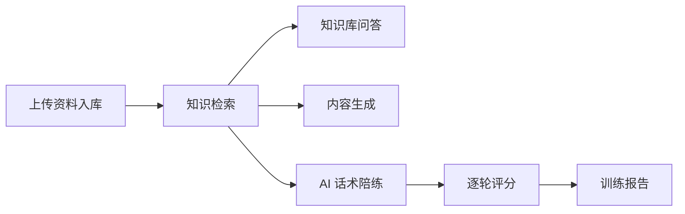
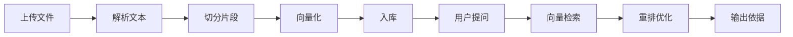
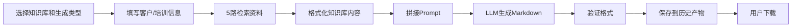
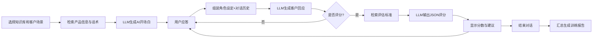

# AI 销售话术陪练与知识库系统——部门推广介绍

> 一句话介绍：这是一款面向销售与培训团队的本地 AI 工作台，集「企业知识库问答」、「销售话术陪练」和「培训内容生成」于一体，让一线人员随时查资料、练话术、出方案。

---

## 一、适用对象与典型场景

### 适用对象

| 角色 | 主要用途 |
|------|---------|
| 销售代表 / 客户经理 | 模拟客户对话、练习产品介绍与异议处理 |
| 培训人员 | 快速生成培训讲义、测试题与 README 使用说明 |
| 产品支撑人员 | 上传产品资料，构建可检索的知识库 |
| 管理者 | 查看团队训练报告，了解话术能力短板 |

### 典型场景

1. **新品上市前**：上传产品白皮书、竞品分析，销售团队先通过知识库问答熟悉卖点，再通过 AI 陪练模拟客户提问。
2. **方案撰写**：输入客户信息和痛点，系统自动从知识库提取依据，生成带引用来源的解决方案 Markdown 文档。
3. **培训赋能**：选择产品知识库，填写培训主题和受众，一键生成讲义、测试题和讲师使用说明。
4. **日常查资料**：遇到客户刁钻问题，直接在知识库问答中提问，AI 基于企业资料作答并标注来源文件。

---

## 二、核心功能介绍

### 1. 知识库管理

你可以把产品资料、销售手册、竞品对比、成功案例等文件上传到系统中，形成一个个「知识库」。每个知识库独立管理，支持：

- **创建知识库**：按产品或业务线命名，如「商务视频彩铃」、「云办公套件」。
- **上传文件**：支持拖拽上传，系统自动解析文件内容。
- **查看导入进度**：实时显示每个文件的处理状态（处理中、成功、失败）。
- **重试失败文件**：对解析失败的文件可一键重新处理。
- **删除知识库**：支持整库删除，方便测试和清理。

**支持的文件格式**：

- 文档：PDF、Word（doc/docx）、Excel（xls/xlsx）、PPT（ppt/pptx）、TXT、Markdown、CSV
- 图片：PNG、JPG、BMP、TIFF、WebP
- 音频：MP3、WAV、FLAC、AAC、OGG、M4A、WMA
- 视频：MP4、AVI、MKV、MOV、WebM、WMV、M4V

### 2. 知识库问答

选择任意一个知识库，进行多轮问答对话。系统的特点是：

- **基于资料回答**：AI 不会凭空编造，而是先从知识库中找到相关依据，再组织答案。
- **标注来源**：每条回答下方列出引用的来源文件和具体片段，方便你核实。
- **多轮对话**：支持连续追问，AI 会结合上下文理解你的问题。
- **切换知识库**：不同产品线使用不同知识库，问答范围精准可控。

### 3. 内容生成

基于知识库内容，自动生成结构化文档，分为两类：

#### 解决方案生成

填写客户信息（单位、决策人、客情关系、决策关注点等）和客户痛点后，系统自动：

- 从知识库检索产品介绍、应用场景、成功案例、差异化优势等资料
- 生成一份 SCQA + MECE 结构的完整解决方案（Markdown 格式）
- 正文中自动内联标注来源文件名，确保有据可查

#### 培训材料生成

填写培训主题、目标客户群、培训对象、时长和目标后，系统自动生成三件套：

- **培训讲义**：按 Gagne 九段教学法组织，包含课程导入、产品知识、客户痛点分析、销售演练、异议处理话术库、总结与行动清单。
- **测试题**：含选择题、填空题、简答题、案例分析题和附加题，覆盖布鲁姆认知分层（记忆→理解→应用→分析→创造）。
- **README 使用说明**：讲师操作指南，含培训前准备、中执行建议、后跟进计划和柯氏四级评估框架。

### 4. AI 话术陪练

模拟真实客户对话，帮助销售代表练习话术。核心特点：

- **多种客户场景**：价格敏感型、技术挑剔型、决策谨慎型、竞品对比型等。
- **AI 扮演客户**：根据选择的场景和产品，AI 自动生成符合角色性格的开场白和回应。
- **流式输出**：AI 客户的回复逐字显示，模拟真实聊天体验。
- **知识库关联**：陪练过程中，AI 会参考知识库中的产品信息，确保不编造功能和价格。

### 5. 逐轮评分

每轮对话结束后，系统从 5 个维度对销售代表的表现进行评分：

| 维度 | 说明 |
|------|------|
| 开场话术 | 是否能自然引入话题、建立信任 |
| 需求挖掘 | 是否能通过提问了解客户真实需求 |
| 产品介绍 | 是否准确传达产品价值、不夸大 |
| 异议处理 | 面对客户质疑时是否能有效回应 |
| 促成技巧 | 是否能推动客户进入下一步决策 |

每个维度给出具体分数（0-100）和文字反馈，同时提供 1-3 条改进建议。

### 6. 训练报告

对话结束后，系统自动生成一份训练总结报告：

- **总分与评级**：优秀 / 良好 / 满意 / 待改进 / 较差
- **各维度得分**：5 个维度的平均分与详细反馈
- **亮点**：本轮表现较好的方面
- **待改进项**：需要加强的维度
- **后续建议**：针对性的练习方向

如果对话中已完成逐轮评分，报告会直接汇总各轮平均分，结果更稳定；否则由 AI 基于对话摘要综合评估。

### 7. 模型设置

所有 AI 模型的配置统一在一个页面管理，修改后实时生效，无需重启服务。

| 模型组 | 默认供应商 | 用途 |
|--------|-----------|------|
| 推理模型 | MiniMax（默认 MiniMax-M2.7，可改为 DeepSeek 等 OpenAI-compatible 服务） | 知识库问答、陪练对话、评分、内容生成 |
| 嵌入模型 | 硅基流动（BAAI/bge-m3） | 把文本转换成便于检索的向量 |
| 重排模型 | 硅基流动（BAAI/bge-reranker-v2-m3） | 对初步检索结果重新排序，优先展示最相关的内容 |

**统一配置的好处**：过去知识库和陪练系统各自维护一套模型配置，现在全部集中在知识库服务（8003）统一管理。陪练系统（8002）不再单独配置 LLM，而是实时读取 8003 的运行时设置。你只需在一个页面修改，所有功能（问答、陪练、生成）同步生效。

### 8. 历史产物

所有生成的 Markdown 文件（解决方案、培训讲义、测试题、README）都会保存到系统中，你可以：

- 在「历史产物」页面查看最近生成的文件列表
- 按文件名、大小、生成时间排序
- 点击下载到本地

---

## 三、模块工作原理

### 1. 统一模型配置

系统包含两个本地服务：

- **知识库服务（8003）**：负责文件解析、向量存储、检索、重排，同时作为统一的 LLM 代理。
- **陪练与生成服务（8002）**：负责场景对话、内容生成、前端界面，但不再单独维护 LLM 配置。

**统一方式**：8002 通过「统一 LLM 客户端」向 8003 动态获取当前模型设置，所有推理请求（陪练对话、评分、内容生成）都经由 8003 转发给配置的推理模型。这意味着：

- 你只需要在前端「模型设置」页面配置一次。
- 修改推理模型、嵌入模型或重排模型后，知识库问答、陪练对话、内容生成和评分会同时使用新配置。
- 无需重启任何服务。

### 2. 文件解析

不同格式的文件有不同的解析路径：

- **普通文档**（docx、xlsx、pptx、txt、md、csv）：直接提取文字内容。
- **扫描件 / 复杂 PDF / 图片**：通过 MinerU OCR 识别文字和版面结构。
- **旧 Office 格式**（doc、xls、ppt）：先通过 LibreOffice 转换为现代格式，再提取文字。
- **音频 / 视频**：通过 ffmpeg 抽取音轨，再通过 Whisper 语音转写为文字。纯视频（无音频）暂不支持。

解析后的文本会被切分成适当长度的片段，方便后续检索。

### 3. RAG 工作方式

RAG（Retrieval-Augmented Generation，检索增强生成）的工作流程是：

1. **用户提问**：输入问题或选择生成类型。
2. **向量检索**：系统把问题转换成向量，到知识库中查找语义相近的文本片段。
3. **重排优化**：初步检索结果经过重排模型重新排序，优先展示与问题最相关的内容。
4. **组织答案**：把筛选后的资料片段作为「依据」提供给 AI，AI 基于这些依据组织回答或生成文档。
5. **标注来源**：回答中标注每个事实对应的来源文件，降低凭空编造的风险。

### 4. 内容生成工作原理

内容生成模块（解决方案和培训材料）的完整工作流程如下：

#### 第一步：多路检索

系统根据你选择的生成类型，自动构造 5 路不同角度的检索查询，从你指定的知识库中并行搜索：

- **解决方案**：检索产品介绍、应用场景、成功案例、差异化优势、实施部署等资料。
- **培训材料**：检索产品功能、客户痛点、销售话术、成功案例、常见问题等资料。

每路查询取回前 5 条最相关的结果。

#### 第二步：结果格式化

把检索到的多个结果按来源文件和相关度分数拼接成一个结构化的「知识库内容」文本块。每个片段都标注了：

- 来源文件名（如 `商务彩铃产品介绍.docx`）
- 相关度百分比（如 85%）
- 具体文本片段

#### 第三步：Prompt 拼接

系统把你填写的信息（如客户单位、决策人、痛点、培训主题、时长等）与检索到的知识库内容一起，按照固定的章节模板拼接到一个大 Prompt 中。Prompt 明确告诉 AI：

- 输出格式必须是 Markdown
- 必须严格遵循指定的章节结构（不可增删改标题）
- 正文中的每个事实段落必须在句末内联标注来源文件名（格式：`📄来源：文件名`）
- 严禁编造功能、数据、日期、版本号
- 总字数要求（解决方案 ≥ 2000 字，培训讲义 ≥ 4000 字）

#### 第四步：LLM 生成

Prompt 通过统一 LLM 客户端提交给 8003 的推理模型：

- **解决方案**：单次调用，温度 0.4（使输出更稳定、结构化），最大 8000 tokens，按 SCQA + MECE 结构生成完整方案。
- **培训材料**：3 次独立调用——
  1. 生成培训讲义（最大 16000 tokens，超时 600 秒）
  2. 基于讲义摘要生成测试题（含布鲁姆认知分层）
  3. 生成 README 使用说明（含培训前准备、执行建议、效果评估）

每次调用温度 0.5，在稳定性和创造性之间取得平衡。

#### 第五步：验证与保存

系统检查生成的 Markdown 是否符合要求：

- 内容不能过短
- 必须包含 Markdown 标题
- 培训讲义必须包含全部 6 个部分

验证通过后，文件保存为 `.md` 格式到 `generation_output` 目录，你可以随时在「历史产物」中查看和下载。

### 5. 陪练系统工作原理

陪练系统的核心是「AI 扮演客户，销售代表练习话术」，其工作流程分为四个环节：

#### 开场白生成

你选择知识库、客户场景和产品后，系统执行以下步骤：

1. **检索产品信息和开场话术**：从知识库中查找产品介绍和与该场景相关的开场话术参考。
2. **构造角色设定 Prompt**：包含——
   - 角色约束：客户的性格特点（如专业、谨慎、挑剔）和沟通倾向（如关注价格、关注技术细节）
   - 关键规则：只能使用知识库中的产品信息，禁止编造功能和价格，用自然的中文说话
   - 场景信息：客户单位、产品名称、背景
3. **提交统一 LLM 生成**：推理模型根据角色设定生成 AI 客户的开场白。温度 0.8，使开场白更自然、有变化。

#### 对话生成（互动循环）

每一轮对话中，当你输入回复后：

1. **组装完整上下文**：
   - System Prompt：角色设定（AI 客户的身份、性格、规则）
   - Conversation History：本轮及之前的多轮对话记录
   - User Message：你（销售代表）的最新回复
2. **提交统一 LLM**：推理模型基于角色设定和对话历史，生成 AI 客户的自然回应。
3. **流式输出**：AI 的回应逐字显示在屏幕上，模拟真实聊天的节奏感。温度 0.8，确保每轮回应有适当的多样性，不会重复相同的话术。

#### 逐轮评分

当你完成一轮对话后，点击「评分」按钮，系统执行：

1. **检索评估标准**：从知识库中搜索「销售话术评估标准」和该场景相关的评估方法。
2. **构造评分 Prompt**：包含——
   - 评估原则：必须基于知识库中的销售方法论，客观、具体、有建设性
   - 对话上下文：轮次、场景名称、客户角色、销售代表说的话、客户回应
   - 知识库中的评估标准（如有）
   - 输出格式要求：纯 JSON，包含 5 个维度（开场话术、需求挖掘、产品介绍、异议处理、促成技巧）的分数与反馈
3. **提交统一 LLM**：推理模型返回 JSON 格式的评分结果。温度 0.3，使评分更稳定、客观，不会因为随机性导致同一轮对话分数波动过大。
4. **结果规范化**：系统把 AI 返回的评分解析为标准化格式，确保每个维度都有分数（0-100）和文字反馈，同时提取 1-3 条改进建议。

#### 训练报告生成

对话结束（达到设定轮次或手动结束）后：

- **如果已完成逐轮评分**：系统直接汇总各轮平均分，按维度计算均值，生成确定性报告。报告包含总分、评级、各维度反馈、亮点、待改进项和建议。这种方式结果稳定，不受 AI 随机性影响。
- **如果没有逐轮评分**：系统先检索知识库中的销售培训标准，然后基于最近 10 轮对话摘要构造 Prompt，由 LLM 生成总结性评估报告。温度 0.3，确保评估稳定客观。

---

## 四、系统流程图

### 系统总流程

### 知识库处理流程

### 内容生成流程

### 陪练流程

---

## 五、使用方式

### 第一步：启动系统

在项目根目录双击运行 `start_services.bat`，一键启动两个服务并自动打开浏览器访问 http://localhost:8002。

你也可以手动启动：

1. 启动知识库服务：`cd rag-anything-api && python start.py`
2. 启动陪练服务：`cd ai-tutor-system && python tutor_backend.py`
3. 浏览器访问 http://localhost:8002

### 第二步：配置模型

首次使用时，切换到「模型设置」页面，填写 API Key：

- **推理模型**：默认 MiniMax-M2.7，需填写 MiniMax API Key。也可切换为 DeepSeek 或其他 OpenAI-compatible 服务。
- **嵌入模型**：默认硅基流动 BAAI/bge-m3，需填写 SiliconFlow API Key。
- **重排模型**：默认硅基流动 BAAI/bge-reranker-v2-m3，与嵌入模型共用同一个 SiliconFlow Key。

点击「保存」后配置实时生效。点击「测试连接」可验证模型是否可用。

### 第三步：创建知识库并上传资料

1. 切换到「知识库」页面。
2. 点击「创建知识库」，输入名称（如「商务视频彩铃」）。
3. 点击知识库名称进入详情页。
4. 拖拽或选择文件上传，支持批量。
5. 在「上传日志」中查看每个文件的处理状态。绿色表示成功，红色表示失败，失败的可点击「重试」。

### 第四步：知识库问答

1. 切换到「知识库问答」页面。
2. 在左侧面板选择要问答的知识库。
3. 在输入框中提问，如「商务视频彩铃的核心功能有哪些？」
4. AI 会基于知识库内容回答，并在回答下方列出引用的来源文件和片段。
5. 支持连续追问，AI 会结合上下文理解。

### 第五步：生成内容

1. 切换到「内容生成」页面。
2. 选择要基于的知识库。
3. 选择生成类型：「解决方案」或「培训材料」。
4. **生成解决方案**：填写客户单位、决策人、客情关系、决策关注点、客户痛点等信息，点击「生成」。
5. **生成培训材料**：填写培训主题、目标客户群、培训对象、时长、培训目标等信息，点击「生成」。
6. 系统会显示生成进度（检索 → 生成 → 保存）。
7. 生成完成后，切换到「历史产物」页面下载 Markdown 文件。

### 第六步：开始陪练

1. 切换到「陪练系统」页面。
2. 选择知识库（AI 客户会基于该知识库的产品信息对话）。
3. 选择客户场景（如价格敏感型、技术挑剔型）。
4. 输入客户单位和产品名称。
5. 点击「开始对话」，AI 客户会主动说出开场白。
6. 你以销售代表身份回复，AI 客户根据你的回应继续对话。
7. 每轮结束后点击「评分」，查看 5 个维度的得分和改进建议。
8. 达到设定轮次后点击「结束」，查看训练报告。

### 第七步：查看训练报告与下载产物

- 训练报告在对话结束后自动显示，包含总分、评级、各维度反馈、亮点和改进建议。
- 所有生成的内容（解决方案、培训讲义、测试题、README）保存在「历史产物」页面，可随时下载。

---

## 六、推广建议

### 试点策略

建议先选 **1-2 个成熟产品**的知识库进行试点，原因：

- 资料齐全，解析成功率高，问答和生成效果好。
- 销售团队对该产品已有一定了解，陪练场景设计更贴近实际。
- 容易产出可见的效果（如生成的解决方案可直接用于真实客户）。

### 试点步骤

1. **第一周**：产品支撑人员整理并上传产品资料（白皮书、销售手册、竞品对比、成功案例）。
2. **第二周**：销售团队通过知识库问答熟悉资料，管理员根据常见客户类型配置陪练场景。
3. **第三周**：销售代表进行陪练练习，每轮查看评分反馈，针对性改进话术。
4. **第四周**：选择 1-2 个真实客户，使用系统生成解决方案或培训材料，验证实用性。

### 扩展节奏

试点验证效果后，可按以下节奏扩展：

- **第 2 个月**：扩展到更多产品线的知识库，培训更多销售代表使用陪练功能。
- **第 3 个月**：引入培训人员使用内容生成功能，批量产出培训讲义和测试题。
- **持续**：定期更新知识库资料（尤其是新产品、新案例），保持系统内容的时效性。

### 常见问题预判

| 问题 | 回应建议 |
|------|---------|
| "AI 生成的内容能直接用吗？" | 系统生成的内容都标注了来源文件，建议先人工核实关键数据和报价，再对外使用。 |
| "陪练的 AI 客户像真人吗？" | AI 客户基于知识库中的真实产品信息回应，不会编造功能和价格，但在情绪和谈判策略上与真人仍有差距，适合用于基础话术训练和卖点熟悉。 |
| "上传的资料安全吗？" | 系统完全本地部署，所有资料和模型调用都在你的电脑上完成，不会上传到第三方云存储。 |
| "需要技术背景才能用吗？" | 不需要。上传文件、问答、陪练、生成内容都有图形界面，模型配置也只需填一次 API Key。 |

---

*本文档面向非技术同事编写，如需技术细节（API 接口、部署配置、代码结构），请参考《SETUP.md》和《使用说明.md》。*
